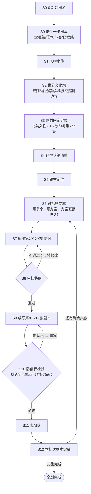

# 海外短剧 · 对标二创 · 多剧本工作流

一套可复用、可循环的海外短剧编剧工作流：以**原创一卡剧本**为唯一世界观基准，以**对标剧**为抽象层参考（冲突类型、钩子类型、信息释放节奏、情绪曲线），批量产出**全新情节发明**的续集剧本，并内置防侵权检验与去 AI 味环节。

## 目录结构

```
.
├── README.md                        # 本文件：总览与使用说明
├── prompts/                         # 各阶段提示词模板（按顺序执行）
│   ├── 00_主控系统提示词.md          # 硬性规则，贯穿全流程，每次对话必须先注入
│   ├── S0-0_新建剧名.md
│   ├── S0_一卡剧本.md
│   ├── S1_人物小传.md
│   ├── S2_世界文化观.md
│   ├── S3_题材固定定位.md
│   ├── S4_已埋伏笔清单.md
│   ├── S5_题材定位.md
│   ├── S6_对标剧文本.md
│   ├── S7_集纲生成.md
│   ├── S8_集纲审核.md
│   ├── S9_剧本续写.md
│   ├── S10_防侵权检验.md
│   ├── S11_去AI味.md
│   └── S12_剧本定稿.md
├── scripts/
│   └── new_project.sh               # 初始化一部新剧的项目目录（支持多剧本并行）
└── projects/                        # 每部剧一个独立目录（由脚本生成）
    └── <剧名>/
        ├── 00_剧目档案/             # S0-0~S5 的产出（一剧只做一次）
        └── 批次01_第001-010集/       # S6~S12 的产出（每批次循环一轮）
```

## 工作流总览



- **S0-0 ~ S5（定基阶段）**：一部剧只执行一次，产出“剧目档案”，之后所有批次共用。
- **S6 ~ S12（循环批次）**：按集数分批循环执行（建议每批 8–10 集），直至写满目标集数（默认 55 集）。

## 使用方法

### 1. 新建一部剧

```bash
./scripts/new_project.sh "剧名" [目标集数] [每批集数] [续写起始集]
# 续写起始集 = 一卡剧本的下一集（一卡覆盖第 1-10 集则填 11），默认 1
# 例：./scripts/new_project.sh "Alpha的替嫁新娘" 55 10 11
```

脚本会在 `projects/<剧名>/` 下生成 `00_剧目档案/` 与全部批次目录及占位文件。

### 2. 执行定基阶段（S0-0 ~ S5）

在与 AI 的对话中：

1. 先注入 `prompts/00_主控系统提示词.md`（每次新会话都要重新注入）。
2. 按顺序使用 `prompts/S0-0` 到 `prompts/S5`，把每个 `{{占位符}}` 替换为你的实际资料。
3. 将每一步产出保存到 `projects/<剧名>/00_剧目档案/` 对应文件。

### 3. 循环执行批次阶段（S6 ~ S12）

每个批次（例如第 11–20 集）：

1. 注入主控系统提示词 + 剧目档案全部内容 + 上一批次定稿（保证衔接）。
2. **S6**：粘贴本批次要参考的对标剧文本（可多个；完全没有则跳过，直接 S7）。
3. **S7**：填写本阶段主题、必须推进的主线、必须埋伏的新线、结尾钩子、付费卡点、是否大结局等参数，生成集纲。
4. **S8**：人工审核集纲，把修改意见回给 AI，得到新集纲，直至通过。
5. **S9**：按已定集纲续写剧本正文。
6. **S10**：做防侵权检验，未通过的场面必须打回 S9 重写。
7. **S11**：去 AI 味润色。
8. **S12**：定稿归档，保存到批次目录，然后进入下一批次，重复 S6–S12。

## 硬性规则（全流程强制，详见 `prompts/00_主控系统提示词.md`）

1. 禁止直接使用对标剧的具体对白。
2. 对标剧只用于抽象层参考：冲突类型、单集钩子类型、信息释放节奏、情绪曲线。
3. 所有人物名、身份、关系网、世界观、背景、性格逻辑、对话风格，必须以一卡剧本为准。
4. 输出必须是"全新情节发明"，不是对标剧的换皮版。
5. 每集先给：本集目标冲突 / 新颖点 / 与前一卡如何衔接 / 与对标差异说明；通过后再写正文。
6. 若对标内容太具体、无法安全借鉴，必须拒绝照搬，只提取抽象结构。
7. 必须以海外市场（默认北美女性受众）的审美与付费习惯为决策依据。

## 节奏与格式基线（S7 / S9 默认执行）

- **节奏**：短、平、快；10 秒一个亮点，30 秒一个反转，每集至少 1 个反转。
- **格式**：三幕式结构（集纲层）；剧本正文格式与一卡剧本一致。
- **风格**：与一卡剧本风格一致。
- **单集时长**：1–2 分钟；**默认集数目标**：55 集。
