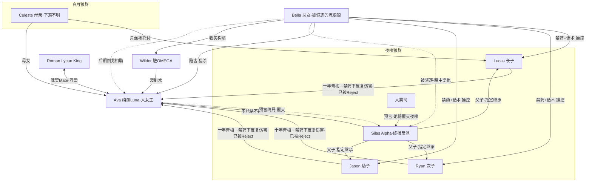

# S1 · 人物小传与关系网（《The Luna's Second Choice》）

> 状态：已产出，待用户审核
> 依据：S0 一卡剧本（第 1–13 集）+ 用户补充"粗写版人设"（2026-07-29）
> 用途：锁死性格逻辑与行为边界，防止续写 OOC；对白必须符合本档案的对话风格。

---

## 主角组（从详）

### Ava（艾娃）

- **身份/职业/阶层**：18 岁，白月狼群 Alpha 公主，罕见的纯血狼人；十年前战败被夜嚎狼群"收归己用"，名义上地位尊贵（Alpha 令牌庇护）、实际是预言的囚徒。
- **关系网位置**：Ava —— 三王子的十年青梅/被指定的联姻对象（已当众 Reject）｜Roman 的魂契 Mate｜Bella 的头号猎杀目标｜Silas 手中"预言之器"｜Celeste 之女。
- **核心欲望**：摆脱错误的关系与被安排的命运，拿回选择权；守护父母与白月狼群；后期升级为统一两狼群、自任 Alpha。
- **核心恐惧**：不怕死、不怕疼，最怕"错误的关系"（第 2 集原话："相比起来，我更害怕错误的关系"）；后期最怕父母/白月狼群受牵连。
- **性格逻辑**：真善美但绝非受虐圣母——先讲理出证据（第 1 集拿出匕首碎片），被践踏就即时反击（第 3 集一拳打肿 Bella），伤及底线（母亲遗物）则不计代价爆发（第 6 集召本体、第 7 集冰封四人）；一旦心死绝不回头，报复可轻可重、有些仇记账后算。对无关者（女仆、宾客）保持善意。
- **对话风格**：短句、冷静犀利，冷笑+反问杀，中英混杂。举证："道歉有用的话，要 Alpha 和拳头干什么！"（第 3 集）；"FUCK YOU！我差点死了！"（第 8 集）；"我本来也没想选你们。"（第 12 集）。对 Roman 时语气放松、会开玩笑（第 9 集："你就不怕我当众拒绝你，给你难堪？"）。
- **秘密与信息差**：知道——自己已与 Roman 魂契（狼群不知）、Bella 用银匕首行刺的真相、Wilder 是构陷。不知道——大祭司预言与"不能杀不能虐"的约束、Bella 的禁药手段、Bella 的驱逐/复仇背景。
- **成长弧线**：一卡结束 = 已 Reject 三兄弟、狼力削弱期、名誉被泼脏、孤立于大殿 → 全剧结局 = 覆灭夜嚎狼群、统一两狼群自任 Alpha，与 Roman 组建家庭。
- **行为红线**：绝不对三兄弟回心转意、绝不摇摆（第 2 集起只爱 Roman）；绝不主动伤害无辜；绝不哀求施害者（只为母亲遗物低过头）；绝不放弃报复正当性——有仇必报，但不滥杀。

### Roman（罗曼）

- **身份/职业/阶层**：Lycan King（古老狼王），上百岁但外表成熟、挺拔、野性；力量碾压所有狼群与狼人，一百年来首次出现能与他匹配的狼魂（第 4 集）。
- **关系网位置**：Roman —— Ava 的魂契 Mate/未婚夫｜凌驾于 Silas 及一切 Alpha 之上的至高存在。
- **核心欲望**：以最高礼仪光明正大地娶到 Ava，给她"独一无二"的位置与绝对后盾。
- **核心恐惧**：几乎无敌，唯一软肋是 Ava 的安危（第 7 集心灵感应她遇险时的失态："FUCK，Ava 有危险！"）。
- **性格逻辑**：霸总式甜宠担当——低调蛰伏、关键时刻降维打击；尊重 Ava 的独立与复仇（帮场不抢戏、递刀不代打）；对敌人零耐心，对 Ava 无限耐心。
- **对话风格**：话少、笃定、低量高压，几乎不解释。举证："我亲自去。"（第 4 集）；"（笑笑）你不会。"（第 9 集）；"下次遇到危险就召唤我。"（第 9 集）。
- **秘密与信息差**：知道——魂契的全部含义、Ava 的独一无二、（可开发）狼族古老秘辛与百年往事。不知道/后知——Bella 禁药、夜嚎内部预言（可作为他调查介入的空间）。
- **成长弧线**：一卡结束 = 已疗伤定情、预告成人礼求婚、人在路上 → 结局 = 与 Ava 成婚组建家庭，为她的统一大业站台。
- **行为红线**：**永不黑化、永不误会、永不怀疑 Ava**；不摇摆、不吃回头醋制造狗血；不越俎代庖替 Ava 完成她自己的复仇；不向夜嚎低头。

### Lucas（卢卡斯）

- **身份/职业/阶层**：20 岁，狼人三兄弟之长，夜嚎狼群 Alpha 王子（三候选人中戏份最重）。
- **关系网位置**：Lucas —— Ava 的十年青梅/背叛者/未来追妻火葬场主力｜Celeste 托付月丝袍的受托人（第 8 集）｜Bella 重点操控对象（道德感+保护欲）｜Silas 长子。
- **核心欲望**：前期：不被任何人控制（第 5 集："我恨被控制！就算是我父亲也不行！"）、守护"善良的 Bella"；真相后：赎罪、赢回 Ava 的原谅（不可得）。
- **核心恐惧**：被欺骗、被操控；真相后最怕的事成真——伤害 Ava 的人是自己，且亲手烧了他承诺守护的托付。
- **性格逻辑**：三人中最成熟、责任感最强，也是唯一会反复起疑的（第 8 集温泉掐 Bella 质问、第 9 集"还是有疑点"）；但每次起疑都被 Bella 用道德绑架/苦情戏按回，或被 Ryan、Jason 带偏；对 Ava 受辱场面会闪过愧疚与迟疑（第 5 集松爪、第 6 集"一丝愧疚"）。摇摆→被按住→更狠，是他的循环模式。
- **对话风格**：沉声命令式、爱下最后通牒，自恋。举证："Ava，我命令你，给 Bella 道歉，现在立刻马上！"（第 3 集）；"Ava，你戴了我的狼牙，就不准死！"（第 1 集）；"别装不在意了。我们知道你已经后悔昨天说过的狠话。"（第 4 集）。
- **秘密与信息差**：不知道——禁药、预言、Ava 已魂契 Roman；知道（独有）——月丝袍是 Celeste 的托付（却在禁药下遗忘其分量，第 8 集被点破才恍然）。
- **成长弧线**：一卡结束 = 被 Reject、吐血倒地、对 Bella 的疑心已埋 → 后续 = 第一个察觉异常、主动调查真相的人；真相揭露（约第 50 集后）成为悔恨最重的追妻火葬场核心；终局随夜嚎覆灭付出代价。
- **行为红线**：不彻底堕落成纯反派（他的恶都有禁药+蒙蔽背景）；起疑戏必须保留（不能写成无脑恋爱脑）；对 Ava 的愧疚闪回不能删；**真相大白前不能知道禁药与预言**。

### Ryan（瑞恩）

- **身份/职业/阶层**：19 岁，狼人三兄弟之次，夜嚎狼群 Alpha 王子；肌肉系暴烈帅哥。
- **关系网位置**：Ryan —— Ava 的十年玩伴/动手最狠的施害者｜Bella 色诱的主要对象｜Lucas 起疑时的"灭火器"（第 9 集一拳打断 Lucas 的质问）。
- **核心欲望**：前期：占有 Bella、用拳头定义是非；真相后：以最极端的方式赎罪。
- **核心恐惧**：前期自认无所畏惧；真相后最怕"无罪可赎"——他是对 Ava 下手最狠的人。
- **性格逻辑**：易燃易爆炸、性情中人、下半身思考——先动手后动脑，谁碰 Bella 跟谁拼命；被色诱即缴械（第 3 集 Bella 靠入怀中他立刻倒戈）。狠得彻底，悔也最极端（愿以命抵罪）。
- **对话风格**：咆哮式短句、开口即威胁。举证："你再污蔑 Bella，我就吃了你！"（第 1 集）；"收起你的心机吧。你再敢耍我们，我的拳头会告诉你我的态度！"（第 10 集）；"FUCK！我们刚刚差点被 Ava 害死了！"（第 8 集）。
- **秘密与信息差**：不知道——禁药、预言、魂契；全剧信息最闭塞（不想知道，只信 Bella）。
- **成长弧线**：一卡结束 = 被 Reject、仍是 Bella 最忠的打手 → 真相后 = 赎罪意愿最极端、愿以命抵罪；终局随夜嚎覆灭付出最重代价。
- **行为红线**：不许变聪明搞阴谋（他只会正面暴力）；不许先于 Lucas 察觉真相；对 Bella 的色令智昏在真相揭露前不许自愈。

### Jason（杰森）

- **身份/职业/阶层**：18 岁，狼人三兄弟之幼，夜嚎狼群 Alpha 王子。
- **关系网位置**：Jason —— Ava 的十年玩伴/跟风施害者（伤害最轻）｜Ryan 的应声虫｜Bella 的顺风旗。
- **核心欲望**：前期：合群、站在"多数"一边不被落下；真相后：像做错事的孩子一样求原谅。
- **核心恐惧**：没有立场可跟（第 11 集："你俩统一一下意见，OK？现在，我到底要站哪边？"）；被集体抛下。
- **性格逻辑**：无主见跟风党——谁声音大听谁的，骂人永远接在别人后面（"没错""就是"开头）；单独面对 Ava 时最先软化；有狼狗属性，讨好型。注意与 Ryan 区分：Ryan 是主动暴烈，Jason 是被动跟从，续写时勿混。
- **对话风格**：跟队式附和、语气词多、幼态。举证："没错，你就是自作自受！"（第 3 集）；"巫师，求你救救 Ava，please！"（第 1 集）；"太恶心了！以后别说你认识我！"（第 12 集）。
- **秘密与信息差**：不知道——禁药、预言、魂契；知道的永远是别人告诉他的版本。
- **成长弧线**：一卡结束 = 被 Reject、仍在跟风 → 真相后 = 最卑微的赎罪者，反复讨好 Ava；终局随夜嚎覆灭付出代价。
- **行为红线**：不能有独立的坏主意（他的恶全是跟出来的）；伤害程度永远最轻；悔后不许硬气。

### Bella（贝拉）

- **身份/职业/阶层**：18 岁，反派女二；被夜嚎狼群驱逐的流浪狼人，烈焰红唇的性感恶女；持有"只针对三兄弟"的定制禁药（心形项链机关）。
- **关系网位置**：Bella —— 三王子的"救命恩人"/实际操控者｜Ava 的猎杀者｜夜嚎狼群的隐形复仇者（终极目标其实是 Silas 与全狼群）｜Wilder 的雇主。
- **核心欲望**：表层：夺 Luna 之位、独占三王子（虚荣+权力）；深层：向驱逐她的夜嚎狼群复仇——自知斗不过整个狼群，故先当 Luna 再让狼群付出代价。
- **核心恐惧**：禁药失效/被识破（第 10 集 Mate 线汇聚 Ava 时"大惊失色、攥紧项链"）；回到人人喊打的流浪狼处境（第 12 集借 Wilder 让 Ava"也尝尝这滋味"，是她自身创伤的投射）。
- **性格逻辑**：深谙人性的操控者，**禁药只是放大器不是遥控器**——放大狼性/人性之恶，再用定制话术分别收割：对 Lucas 用道德感与保护欲（苦情、自伤、"我可以离开你们~"）、对 Ryan 用色诱、对 Jason 用从众裹挟；药效失控或被质疑时立刻加码新手段（自扇嫁祸第 7 集、袒伤洗白第 9 集、雇 Wilder 第 11 集）。手段升级链条清晰，从不重复。
- **对话风格**：当面娇嗔拖长音"Babe~""Oh Ava，我很抱歉~"（第 3 集），OS 狠毒直白"FUCK！又让她活了下来..."（第 8 集）、"未来 Luna 的位置只能是我的，你必须死！"（第 1 集）。双面反差是她的标志。
- **秘密与信息差**：知道——禁药的存在与用法、自己的驱逐/复仇计划、Wilder 是她安排的。不知道——大祭司预言、Ava 已魂契 Roman；**甚至不认识 Roman**。第 11 集她喊"Ava 心里另有他人"并非情报优势，只是为 Wilder 闯场泼脏水搞鬼铺垫；Ava OS"Bella 是怎么知道"是误读——Bella 并不知道，她只是想搞鬼（用户已确认）。禁药失灵她只知结果、不知原因。
- **成长弧线**：一卡结束 = 秘密武器失灵、构陷得逞一半 → 中期 = 手段全面升级、伤及 Ava 父母/白月狼群（覆灭导火索）→ 后期 = 见 Ava 报复夜嚎，倒戈相助、甚至付出生命；背后故事在全部真相揭开之后再讲。
- **行为红线**：绝不降智（不许出"一闻就傻"的写法）；绝不真心爱上三王子；手段可以恶毒但必须"好看"（有设计、有升级）；倒戈前绝不心软。

### Silas（塞拉斯）

- **身份/职业/阶层**：几十岁（外表比 Roman 显老），夜嚎狼群 Alpha，三兄弟之父；十年前战胜白月狼群的征服者。
- **关系网位置**：Silas —— 三王子之父/夜嚎最高权力者｜Ava 的"恩主"兼真正的囚笼｜大祭司预言的唯一执行人｜全剧终极大反派。
- **核心欲望**：保住夜嚎狼群的存续与霸权——预言说 Ava 会覆灭狼群，他的一切动作（不杀、不虐、联姻、指定继承）都是为了"收归己用"。
- **核心恐惧**：预言成真；诅咒应验（不能杀、不能虐的枷锁）；Ava 脱离掌控——所以第 12 集他不惜当众失态阻止 Reject。
- **性格逻辑**：政治动物——当众是慈爱恩主（第 11 集成人礼致辞"她为我们带来了爱与和平"），私下一切以狼群利益计算（第 2 集听完预言第一反应是拔刀）；对儿子们有权威但压不住（第 12 集被三子当众顶撞气到心口疼）。
- **对话风格**：高台宣言式、威严排比；涉密时支支吾吾露馅。举证："月神见证，今天，白月狼群被我们打败了！"（第 2 集）；"（支支吾吾）没有秘密...只是因为...你已经在这生活了十年..."（第 12 集）。
- **秘密与信息差**：知道（几乎独有）——大祭司预言全文与诅咒约束。不知道——禁药、魂契、Bella 底细。他的全部布局建立在"Ava 必嫁我子"上，此根基已在一卡结尾崩塌。
- **成长弧线**：一卡结束 = 布局崩塌、当众失态心口剧痛 → 中期 = 为按住预言不择手段（唯不能杀/虐 Ava，这是他的镣铐也是戏眼）→ 终局 = 作为大反派被 Ava 覆灭。
- **行为红线**：**任何情况下不能直接杀害或虐待 Ava**（诅咒约束，他的所有恶必须绕开这条线走"软刀子"）；不知情禁药之事前不得与 Bella 结盟穿帮；不能提前泄露预言。

---

## 配角组（从简）

- **Celeste（塞莱斯特）**——Ava 之母，白月狼群（第 8 集闪回登场）。十年前亲手缝制月丝袍并托付 Lucas。下落未明（伏笔 F08）：她与 Ava 之父的安危是后期覆灭夜嚎的导火索。红线：不得在真相线成熟前随意写死或写活，需用户确认走向。
- **大祭司**——夜嚎狼群祭司（第 2、12 集闪回）。预言的源头："Ava 会覆灭夜嚎狼群；不可杀不可虐，否则狼群遭诅咒。"神秘中立，可作后续解读预言/魂契规则的功能位。
- **Wilder（怀尔德）**——被 Bella 收买的脏臭 OMEGA 流浪狼（第 11–12 集）。受雇构陷 Ava"与他有染"。贪婪猥琐、给钱就演。是坐实 Bella 罪行的活证据（伏笔 F11）。
- **巫师**——森林木屋的治疗者（第 1 集）。救回 Ava 一命；"巫师治过的伤，没那么容易崩开"（第 3 集 Lucas 台词）可作后续验伤/验药的证据位。
- **Roman 的仆从**——狼王城堡侍从（第 4、7 集）。功能位：见证魂契百年难遇、传递狼王动向。
- **女仆 1/2、宾客、裁判**——夜嚎狼群群像。"观众嘴替"，负责用吃瓜台词点破局势（第 4、6、10 集）。续写保留此功能。

---

## 全剧关系网图

> 实线 = 一卡已发生的关系；虚线 = 已埋定但未发生的走向。

---

## 续写防 OOC 速查（本档案结论）

1. 摇摆权只属于三兄弟（Lucas 最多、Jason 次之、Ryan 最少）；Ava 与 Roman 无摇摆权。
2. 三兄弟区分度：Lucas 用脑（会疑）、Ryan 用拳（会炸）、Jason 用跟（会附和）——台词不可互换。
3. Bella 每次得逞必伴随一次"手段升级"，禁药只做放大器。
4. Silas 的恶必须绕开"杀/虐 Ava"走软刀子。
5. 配角女仆/宾客的吃瓜评论是本剧固定叙事件，续写保留。

【等待指令】
